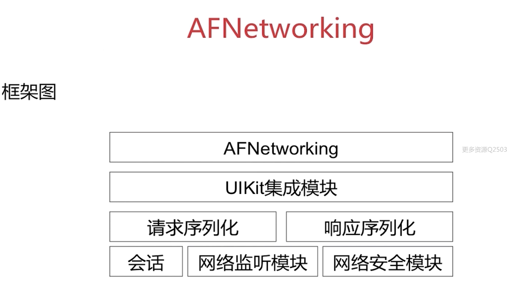
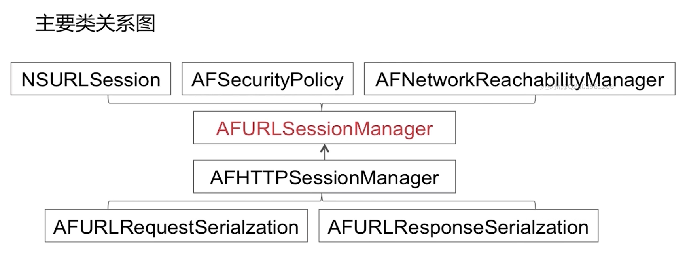
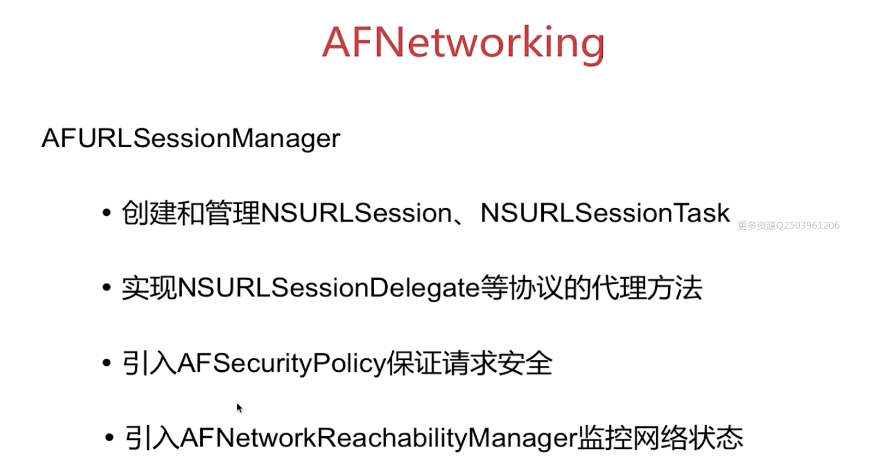
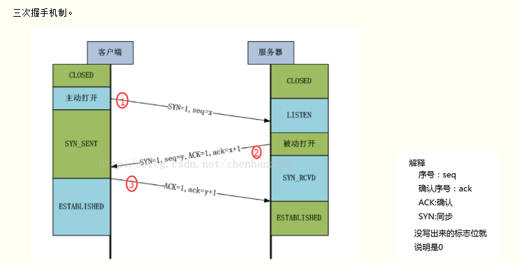

# 某智能物联网公司二三面

### 1. AFN 实现原理 2.0 3.0 区别

 2.0 3.0 的区别是 NSURLSession 替换了 NSURLConnection。3.0 不再需要常驻线程，且去掉了 operationQueue

> ref：
>
> * [iOS AFN 3.0版本前后区别 02](https://blog.csdn.net/shihuboke/article/details/75331456)

## 多线程的使用 各种区别

* NSThread，每个NSThread对象对应一个线程，量级较轻（真正的多线程），通常会起一个 runloop 保活；
* GCD，Grand Central Dispatch（派发） 是基于C语言的框架，可以充分利用多核，是苹果推荐使用的多线程技术
* NSOperation：基于 GCD 的封装，面向对象的多线程技术

**NSThread：**

* 优点：轻量级，使用简单
* 缺点：需要自己管理线程的生命周期，一般我们可以起一个 runloop，然后保活，另外线程同步、加锁、睡眠以及唤醒也需要自己用；

**NSOperation**

* 优点： 使用者的关注点都放在了 operation 上，而不需要线程管理。
  * 支持在操作对象之间依赖关系，方便控制执行顺序。
  * 支持可选的完成块，它在操作的主要任务完成后执行。
  * 支持使用KVO通知监视操作执行状态的变化。
  * 支持设定操作的优先级，从而影响它们的相对执行顺序。
  * 支持取消操作，允许您在操作执行时暂停操作。

* 缺点：高级抽象，性能方面相较 GCD 来说不足一些;

**GCD：**

* 优点：GCD更接近底层，而NSOperationQueue则更高级抽象，所以GCD在追求性能的底层操作来说，是速度最快的，有待确认

* 缺点：操作之间的事务性，顺序行，依赖关系。GCD需要自己写更多的代码来实现

### 启动崩溃防护如何实现

* 微信读书的 [iOS 启动连续闪退保护方案](https://wereadteam.github.io/2016/05/23/GYBootingProtection/)
  * 第一种方式：在 PLCrashReporter 这类工具来检测连续闪退：
    * 首先维护一个计数变量，表示连续闪退次数
    * 在 PLCrashReporter 的 crash handler 中加入逻辑：如果启动 5s 内 crash 使计数器加一
    * 每次启动时，如果连续闪退计数 > n，则检测到了连续闪退
    * 启动后，执行一个定时任务，在 5s 后重置计数（如果 App 连续闪退则不会重置）
* 计时器方法
  * 维护一个计数变量，用于表示连续闪退的次数
  * 在启动 application:didFinishLaunchingWithOptions: 后使计数加一
  * 接着使用 dispatch_after 方法在 5s 后清零计数，如果 App 活不过 5 秒计数就不会被清零
  * 如果发现计数变量 > n，表明 App 连续 n 次连续闪退，启动保护流程，重置计数。
  * 当保护流程完成后，进入 App 正常启动流程

* [iOS防止崩溃机制以及底层原理](https://blog.csdn.net/goodluckwujie/article/details/84255814)

### KVO 和 KVC 实现，平时怎么用

见 objectie-C 基础知识

KVO 会为需要observed的对象动态创建一个子类，以`NSKVONotifying_` 最为前缀，然后将对象的 isa 指针指向新的子类，同时重写 class 方法，返回原先类对象，这样外部就无感知了；其次重写所有要观察属性的setter方法，统一会走一个方法，然后内部是会调用 `willChangeValueForKey` 和 `didChangevlueForKey` 方法，在一个被观察属性发生改变之前， `willChangeValueForKey:`一定会被调用，这就 会记录旧的值。而当改变发生后，`didChangeValueForKey:`会被调用，继而 `observeValueForKey:ofObject:change:context:` 也会被调用。

### 计算机网络相关 握手 挥手 浏览器输入url经历了什么

三次握手，四次挥手，三次握手目的是为了确认双方收发能力。 TLS SSL 是四次交换

1. 客户端发送建立连接包，控制为 SYN = 1，seq =x 表示包序号，自己状态置为 SYN_SENT，服务端从 Listen 状态改为 SYNC_RECEIVED；（**服务端确认了客户端的发送能力，以及自己的接收能力。**）
2. 服务端然后发送控制位 SYN=1，seq = y，ACK=1，ack=x+1；客户端状态变为 ESTABLISHED。（**客户端这边已经确认自己收发能力OK，服务端的收发能力OK**）
3. 发送 ACK = 1，seq = x+1，ack = y+1，服务端接收后状态改为 ESTABLISHED；（**服务端确认客户端的接收能力ok，之前也发送能力也ok；同时也确认了自己的发送能力ok，第一次建立连接时候确认了接收也没问题。**）

> 等 2ms 的原因是，怕客户端发送的 ack = 1 包服务端没有收到，然后又发过来一个 FIN=1 包，所以延迟等待。同样是为了确保双方都确实接收到了对应的指令。

### 出现接口慢的问题，如何排查；

* 确定是否是手机网络问题；
* 排查系统是否存在影响网络的外网调用 
* 是否接口本身响应过慢呢 ，charles 抓包或者chrome看
* 服务端接口日志查看，是否因为并发多导致了接口返回数据慢
* 登录后台服务器/监控平台，查看系统资源是否达到上限，例如：CPU、内存、磁盘、I/O、网络带宽等
* 检查应用服务器（Jboss/Tomcat）的线程池配置是否合理，看一下请求的排队现象是否严重，如果严重则需要重新设置合理的线程池。同样，检查一下数据库的连接池设置是否合理，增大连接池设置，同时检查一下是否有慢sql，如果有慢sql，则进行优化（优化方案是查看执行计划，设置合理的索引等）；
* DNS 解析时间，SSL 握手时间等等。

### 弱网情况下如何优化

* [iOS 开发 -- 关于弱网优化](https://www.jianshu.com/p/bd26837f2bd3)
* [浅谈APP弱网优化](https://www.jianshu.com/p/3f31f9e8f5ea)

1. 合适的超时时间，针对不同网络设定不同的超时时间，加快超时，尽快重试
2. 分子模块多请求去请求数据，避免一次性加载，导致数据太多请求返回慢；
3. 缓存和增量请求
4. **优化DNS查询：**应尽量减少DNS查询，做DNS缓存，避免域名劫持、DNS污染，同时把用户调度到“最优接入点”。
5. 减小数据包大小和优化包量：通过压缩、精简包头、消息合并等方式，来减小数据包大小和包量。
6. **优化ACK包：**平衡冗余包和ACK包个数，达到降低延时，提高吞吐量的目的。（这些难度有点高）
7. 断线重连，因为我们是 socket 通信的，所以需要做断线重连，重连时间可以递增
8. 减少数据连接的创建次数，由于创建连接是一个非常昂贵的操作，所以应尽量**减少数据连接的创建次数**，且在一次请求中应尽量以批量的方式执行任务。如果多次发送小数据包，应该尽量保证在2秒以内发送出去。在短时间内访问不同服务器时，尽可能地复用无线连接。
9. 用户 UI 体验优化，加载一些动画什么的分散下注意力

接口设计优化方案二：
在于后端设计接口是可以从以下几方面优化：

1. 慢查询监控 
2. 多查询优化
3. 常用接口cache：对于常用的接口进行缓存处理。
4. 多接口合并：所谓的多接口合并也就是某个页面内请求过多，也可以考虑做一定的请求合并。

数据压缩再处理

1. 对数据进行 Gzip 压缩。
2. 精简数据格式,如 JSON 代替 XML，WebP 代替其他图片格式。
3. 针对不同设备不同网络返回不同数据格式。 如不同分辨率图片大小（可配合七牛）：
   * 2/3G使用低清晰度图片——>下发300X240，精度为80的图片
   * 4G普通清晰度图片——>下发600X480，精度为80的图片
   * WiFi高清晰度图片（最好根据网速来判断，wifi也有慢的）——>下发600X480，精度为100的图片。

**数据缓存**
对首页及特定一级页面进行数据缓存，在一定的有效时间内再次请求可以直接从缓存读取数据，也可避免空白页出现影响体验。

**界面优化**
1.针对弱网(移动网络), 不自动加载图片（显示本占位图）。
2.界面先反馈, 请求延迟提交。例如, 用户点赞操作, 可以直接给出界面的点赞成功的反馈,在网络情况较好的时候再发起请求.（类似支付宝没网也能扫码支付。）

### 图片缓存如何优化

参照 SDWebImage 。

### 线程安全锁

@synchronized、 NSLock、NSRecursiveLock、NSCondition、NSConditionLock、pthread_mutex、dispatch_semaphore、OSSpinLock、atomic(property) set/ge

# 三面 题目

### 路由区别

### 新建一个工程后，使用什么技术结构，为什么

### 平台开发选用什么技术栈

### 平台以后的发展

### 
